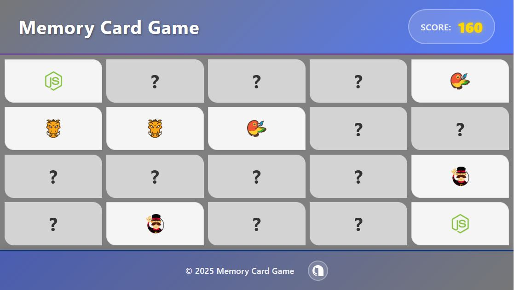

# React + Redux + Vite

* Gereksinimler
* Kart çiftleri, matris üzerine karmaşık olarak dağıtılmalıdır.
* Üst üste iki kart açıldığında, eğer aynı kartlar değilse açılan kartlar geri kapanmalıdır ve 10 puan eksilmelidir.
* Üst üste iki kart açıldığında, eğer kartlar aynıysa geri kapanmamalıdır ve 50 puan eklenmelidir.
* Kullanıcı puanını ekranın herhangi bir yerinde gösterebilirsiniz.
* Tüm kartlar açıldığında "Yeniden Oyna" adında bir buton gösterilmeli ve bu butona tıklandığında kartlar kapanarak yeniden karıştırılmalıdır.

## npm install
## npm run dev
