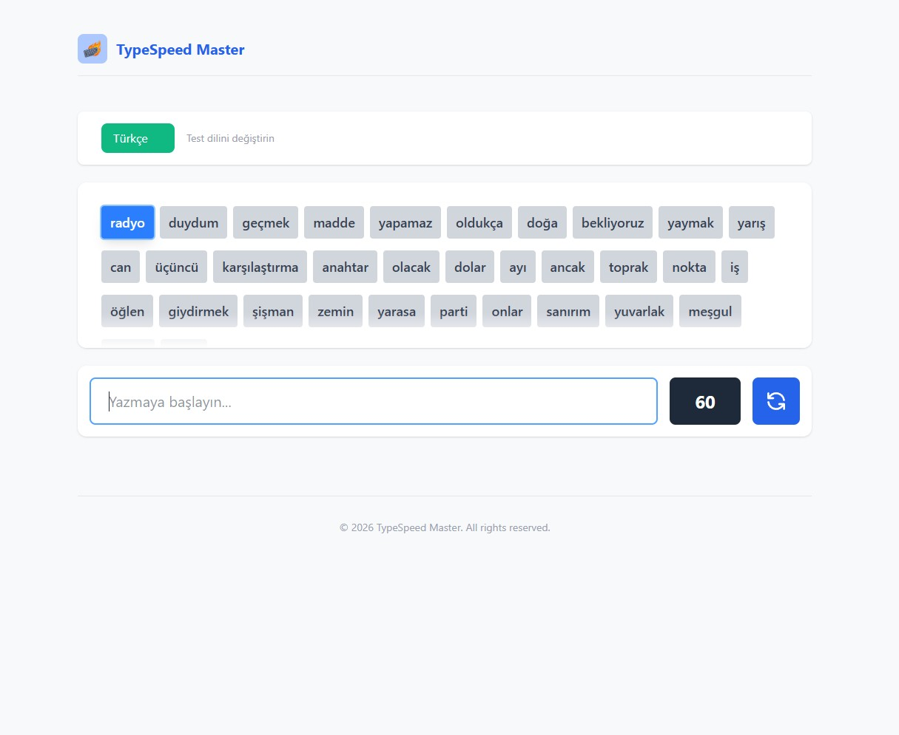
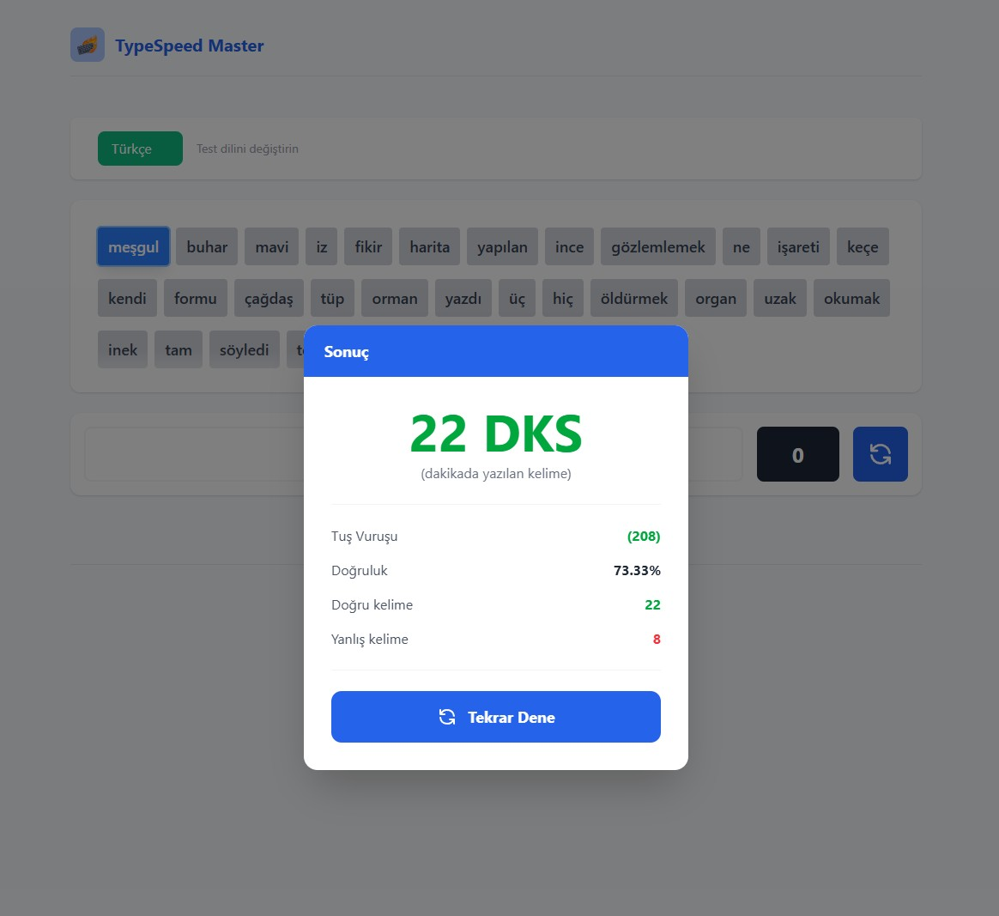

# Typing Speed App - React + Vite + Redux - patika.dev

Gereksinimler
* Rastgele üretilecek olan kelimeler karmaşık olarak yan yana gösterilmelidir.
* Kullanıcıya 60 saniyelik süre verilmeli.
* Input'a herhangi karakter girdiği anda geri sayım başlamalıdır.
* Doğru girilen her kelime yeşil, yanlış girilen her kelime kırmızı olarak gösterilmelidir.
* Restart butonuna tıklanarak oyun yeniden başlatılabilmelidir.
* Geri sayım tamamlandığında sonuçlar gösterilmelidir.

## npm install
## npm run dev
